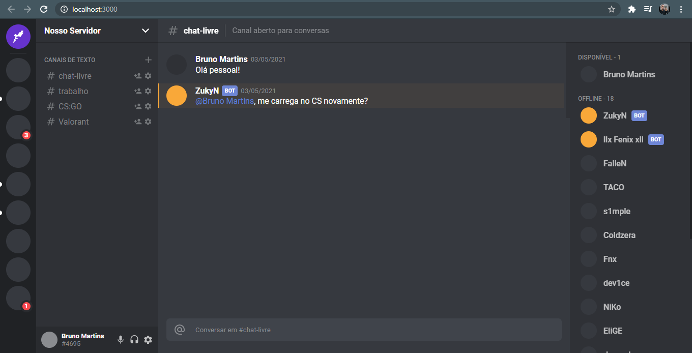
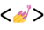

## Discord Clone

This project is about the Discord interface clone, presented by **[Rocketseat](https://github.com/Rocketseat)**.

---

### Discord page



---

## Technologies

<div align="start">
  <br />
  
</div>

- [React.js](https://reactjs.org/)

<div align="start">
  <br />
  
</div>

- [Typescript](https://www.typescriptlang.org/)

<div align="start">
  <br />
  
</div>

- [Styled Components](https://styled-components.com/)

---

## Getting started

### Requirements

- You need to install both [Node.js](https://nodejs.org/en/download/) and [NPM](https://www.npmjs.com/) to run this project.

**Clone the project**

```bash
$ git clone https://github.com/brunomart97/clone-discord.git
```

**Follow the steps**

```bash
# Access the project folder
$ cd clone-discord

# Install the dependencies
$ npm install

# Run the web server
$ npm start
```

The application will be available at `http://localhost:3000`

---

### Author

<p>
    
    <br />
    <sub><strong>Bruno Martins da Silva</strong></sub>
</p>

[](https://www.linkedin.com/in/brunomart97/)
